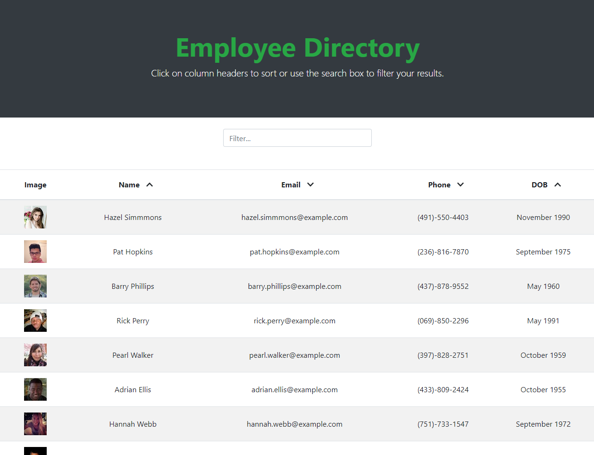

# Employee Directory

## General 📖
---    
- Github:   https://github.com/Kyle7286/employee-directory
- Deployed: https://kyle7286.github.io/employee-directory/

## About/Purpose ❔
---
A simple React application which is a user/employee directory that allows you to sort by each column and filter by text input.

## Takeaways
- Gained confidence with React, using props and blending HTML/JS via JSX
- Learned how to import functions into my container from util folder, modularizing my logic
- Had a ligh-bulb moment for how to properly filter data by having a static set of data and a visible set of data
- Understand how the state is leveraged and what its used for to dynamically render your components in real time.

## How to Use
---
1. Navigate to website
2. Click on columns to sort the data
3. Use the filter box to filter down the data
4. Refresh to get a new set of data

## Screenshot(s) 📊
---

-

## Thank you 👍 
---
Thank you for your time checking out our website! It means a lot  :)